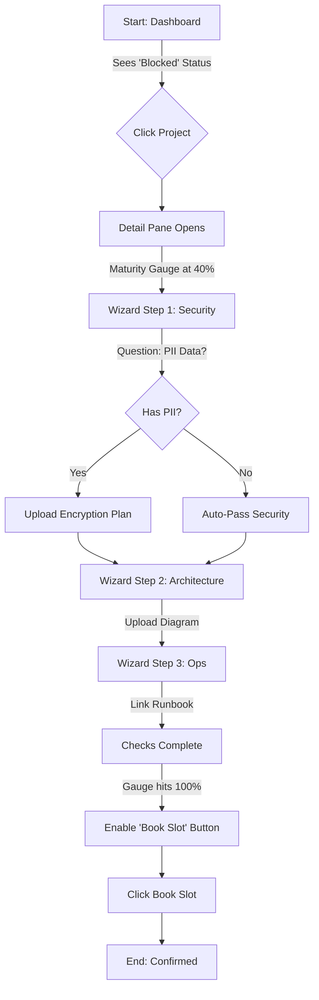
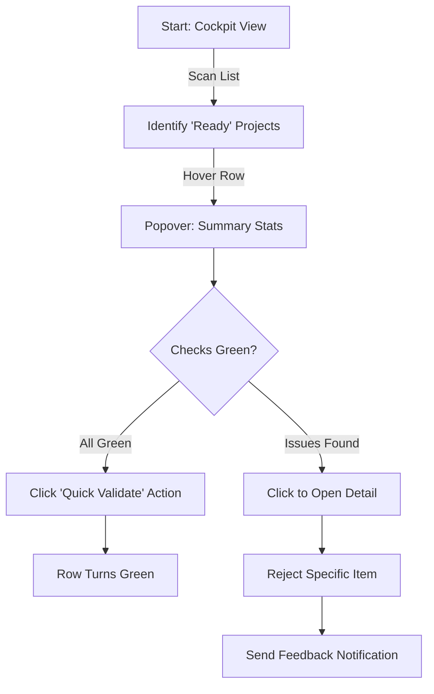

# UX Design Specification Architecture Planning

**Author:** Geo
**Date:** 2026-01-19

---

## Executive Summary

### Project Vision
The **Archiboard Platform** is a Quality Governance Platform that shifts the paradigm from "booking a slot" to "ensuring readiness". It addresses the chaos of manual scheduling by enforcing a "No read, no meet" policy through asynchronous pre-validation, exclusively optimized for a desktop-centric professional workflow.

### Target Users
*   **Project Leaders**: Need clarity and guidance. On PC, they expect a structured, form-based interface that guides them step-by-step through the "Golden Checklist".
*   **Reviewers**: Professional architects working from their desks. They need a **High-Density Dashboard** to scan multiple projects quickly, with detailed views available side-by-side (Review vs. Documents).
*   **Organizers**: Power users who need to manage the grid/schedule efficiently.

### Key Design Challenges
*   **Information Density vs. Clarity**: With a large screen, the temptation is to show everything. The challenge is to organize the "Maturity Score", "Checklist", and "Documents" into a coherent **Cockpit View** that aids decision-making without cognitive overload.
*   **Friction vs. Guidance**: The "Gatekeeper" checks must feel like a smart assistant (Wizard style) rather than a barrier.
*   **Speed of Review**: Reviewers shouldn't have to click 10 times to validate. Efficiency on desktop means minimal navigation steps.

### Design Opportunities
*   **Split-Screen Reviews**: Leveraging the PC monitor to show the "Golden Checklist" on the left and the "Proof Documents" (preview) on the right for seamless validation.
*   **Power User Navigation**: Keyboard shortcuts and hover-states to speed up the "Review -> Validate/Reject" workflow.
*   **Rich Data Visualization**: Using the screen real estate to show detailed Maturity Radar Charts or timelines that wouldn't fit on mobile.

## Desired Emotional Response

### Primary Emotional Goals
**"Professional Mastery"**: Users should feel like a **Pilot in a Cockpit**. The interface should convey control, precision, and efficiency. The goal is to shift from "administrative drudgery" to "professional governance".

### Emotional Journey Mapping
*   **The Reviewer (Relief):** Moving from anxiety ("What mess is this?") to **Relief** ("It's all here, I can review this in 5 minutes."). Seeing a high Maturity Score should create a physical sense of ease.
*   **The Project Leader (Guided Confidence):** Moving from confusion ("What do they want?") to **Certainty** ("The system says I'm ready."). The system provides the assurance that they won't be humiliated in the meeting.

### Micro-Emotions
*   **The "Block" (Missing Data):** Should not feel *Punishing*. It must feel **Helpful**. No big red "ERROR" banners; instead, use constructive warnings like "Just one step left to unlock booking."
*   **The "Validation" (Green Light):** Should feel **Satisfying**. The transition from "Draft" to "Validated" should be crisp and rewarding (e.g., subtle animation of a checkmark snapping into place).

### Design Implications
*   **Constructive Feedback:** Error messages should always propose the solution (e.g., "Upload DAT Sheet to fix this" vs "Error: Missing File").
*   **Visual Assurance:** Use steady, calm colors (Blues, Greens) for status indicators. Avoid "Alarmist Red" unless critical.
*   **Predictability:** The interface must behave consistently. No surprises. "If I click this, I know exactly what will happen."

### Emotional Design Principles
1.  **Pilot, not Passenger:** Give the user the controls.
2.  **Calm Efficiency:** The UI should lower the heart rate, not raise it.
3.  **Constructive Guardrails:** The system is a safety net, not a wall.

<!-- UX design content will be appended sequentially through collaborative workflow steps -->

## Responsive Design & Accessibility

### Responsive Strategy (Desktop-First, Mobile-Ready)
Prioritize the Desk/Office experience (95% usage), but ensure the application is **fully functional on mobile** for the "Transit/Emergency" use case (5% usage).

*   **Desktop (Primary):** "The Cockpit". High density, Master-Detail split view, simultaneous information visibility.
*   **Mobile (Secondary):** "The Companion". Stacked view. Focus on "Consultation" and "Status Checking".
    *   **Behavior:** The Master-Detail view collapses. The List becomes the Home Screen. Clicking a project navigates to a full-screen Detail View.
    *   **Constraints:** Complex editing (e.g., uploading large architectural diagrams) is possible but not optimized. Quick actions (validating, checking status) are optimized.

### Breakpoint Strategy
*   **Desktop (>1024px):** Split View active. Sidebar visible.
*   **Tablet (768px - 1024px):** Sidebar collapses to Icon Rail. Split View maintained if space permits, else Stacked.
*   **Mobile (<768px):** Single Column. Full-width cards. Hamburger menu for navigation.

### Accessibility Strategy (WCAG 2.1 AA)
*   **Keyboard Navigation:** Critical for the Reviewer persona (Power User). Arrow keys to navigate the project grid, `Enter` to open, `Esc` to close details.
*   **Semantic HTML:** Use proper landmarks (`<nav>`, `<main>`, `<aside>`) to ensure Screen Readers understand the "Cockpit" layout.
*   **Color Contrast:** Maintain `4.5:1` contrast for text, especially within the density of the grid. ensure "Status Colors" (Red/Green) have accompanying icons or text labels for color-blind users.

## UX Consistency Patterns

### Button Hierarchy (The Action Model)
We strictly limit the cognitive load of actions:
*   **Primary Action (`MH Blue`):** Only ONE per screen view (e.g., "Request Review", "Book Slot").
*   **Secondary Action (`Outline`):** For safe alternative paths ("Edit", "Download", "Save Draft").
*   **Destructive Action (`Coral` Text):** No fill unless it's a confirmation modal. Reduces accidental clicks.

### Feedback Pattern (The Notification Model)
*   **Toasts (Transient):** Use for successful system actions that don't require further input ("Saved", "Link Copied").
*   **Banners (Persistent):** Use for blocking states that persist until resolved ("Review Blocked by Security").
*   **Inline (Contextual):** Use for immediate form validation errors.

### Navigation Pattern (The "Deep Link" Model)
*   **Master-Detail Behavior:** Clicking a project row **opens the Detail Pane**; it does NOT trigger a full page navigation. This preserves the Reviewer's list context.
*   **Back Button Logic:** In the application context, "Back" closes the Detail Pane (`ESC` key behavior), returning focus to the List.
*   **URL Strategy:** URLs *should* update (e.g., `/projects/123`) to allow deep-linking, but the transition is an SPA state change, not a reload.

## Component Strategy

### Design System Components (Shadcn/UI Base)
We will leverage the following standard components directly:
*   **Structure:** `Card`, `Resizable` (for Master/Detail), `Sheet` (for Help).
*   **Data:** `Table` (TanStack), `Badge` (Status), `Avatar`.
*   **Input:** `Form`, `Select`, `Combobox`, `DatePicker`.

### Custom Components (Governance Specific)

#### 1. `<MaturityGauge />`
*   **Purpose:** Visualizes the aggregate readiness of a project across multiple dimensions (Security, Tech, Ops).
*   **Anatomy:** A segmented track (like a car speedometer or Health bar). 3 Segments. 0-33% (Red), 33-66% (Yellow), 66-100% (Green).
*   **States:** `Loading`, `Incomplete` (Ghosted), `Complete` (Solid Color).
*   **Usage:** Appears in the Project Row (Mini) and Top of Wizard (Large).

#### 2. `<WizardShell />`
*   **Purpose:** Enforces the "Guided Check" mental model. Prevents users from getting lost in a 50-input form.
*   **Anatomy:**
    *   **Header:** Step Name + Progress Dots.
    *   **Body:** Single focus question or form group.
    *   **Footer:** "Back", "Next", "Save Draft" (Auto-save indicator).
*   **Interaction:** Keyboard accessible (`Enter` to Next).

#### 3. `<SmartBadge />` (Interactive Status)
*   **Purpose:** Allows rapid status updates from the list view (The "Zero-Click" pattern).
*   **Anatomy:** Looks like a standard Badge. On Hover, expands to show `Reject` (X) and `Approve` (Check) icon buttons.
*   **States:** `Idle` (Static Text), `Hover` (Actions revealed), `Loading` (Spinner replaced icon), `Success` (Green flash).

### Implementation Roadmap
*   **Phase 1 (Core):** Setup Shadcn + Build `<SmartBadge />` (Critical for Reviewer Flow).
*   **Phase 2 (Wizard):** Build `<WizardShell />` + `<MaturityGauge />` (Critical for Leader Flow).
*   **Phase 3 (Polish):** Advanced animations for the Gauge and Row transitions.

## User Journey Flows

### Journey 1: The Project Leader ("Getting to Green")
**Goal:** A Project Leader needs to transition their project from "Blocked" to "Ready" by satisfying governance checks.
**Trigger:** Needs to book a slot for an upcoming architecture review.

### Journey 2: The Reviewer ("The Zero-Click Clear")
**Goal:** A Reviewer needs to validate "Clean" projects efficiently to focus time on "Problem" projects.
**Trigger:** Dedicated review time block (Morning governance sweep).

### Journey Patterns
*   **The "Context Drawers"** (Detail Pane): Never leave the list. Details always slide in or appear adjacent to the context.
*   **The "Progressive Disclosure"** (Wizard): Don't show 50 inputs. Show 3 relevant inputs based on the previous answer.
*   **The "Stateful Actions"**: Buttons change state. "Submit" becomes "Success" instantly.

### Flow Optimization Principles
*   **Review Speed:** Minimizing clicks for the "Happy Path" (Validating a good project).
*   **Error Recovery:** If a check fails (e.g., Runbook link 404s), show the error *inline* immediately, don't wait for a full "Submit".
*   **Positive Reinforcement:** Fill the gauge visually. Give dopamine for administrative compliance.

## Design Direction Decision

### Design Directions Explored
We explored three variations: 
1. **"The Cockpit" (Dense):** A full-screen, high-density dashboard suitable for ops/power users.
2. **"The Canvas" (Spatial):** A spacious, card-based interface focused on guidance.
3. **"The Hybrid" (Mixed):** A master-detail split view combining density with focus.

### Chosen Direction
**Direction 3: The Hybrid**
A layout that features a dense, efficient Project List on the left (Reviewer context) and a focused, guided "Wizard" workspace on the right (Leader context).

### Design Rationale
*   **Best of Both Worlds:** Solves the core tension between "Speed of Review" and "Ease of Entry". Reviewers get their high-density list to scan status quickly. Leaders get a focused, less overwhelming "Wizard" view to fix issues without losing context.
*   **Mental Model Alignment:** Closely mirrors the **"Master-Detail"** pattern (like Outlook, Linear, or GitHub Notifications), which is familiar to corporate power users.
*   **Scalability:** The Master-List scales to hundreds of projects via scrolling/filtering, while the Detail pane remains constant in complexity.

### Implementation Approach
*   **Global Nav:** Collapsed Icon Rail (64px wide, `Slate-900`).
*   **Master Pane:** Resizable list view (320px-480px, White). Uses "Cockpit" density (row height ~40px).
*   **Detail Pane:** Main workspace (Flex grow, `Neutral Surface`). Uses "Canvas" spacing (cards, clear headers).
*   **Interaction:** Clicking a list item updates the Detail pane immediately (no page reload). "Selection" state is clearly visible in the list.

## Visual Design Foundation

### Color System
**Primary Palette (Brand):**
*   **Primary Brand:** `MH Blue` (#065679) - Used for primary buttons, active states, and key headers.
*   **Neutral Surface:** `Light Grey` (#F6F8FC) or `Beige` (#F5F1E5) - Used for app backgrounds to reduce eye strain.
*   **Text High Contrast:** `Black` (#000000) - Main headings.
*   **Text Body:** `Dark Grey` (#404040) - Primary content.

**Semantic Highlights (Functional):**
*   **Success (Validated):** `Dark Green` (#5E803F) - For "Green Light" status and "Passed" checks.
*   **Warning (Attention):** `Yellow` (#F2CC60) - For missing info or upcoming deadlines.
*   **Destructive (Blocked):** `Coral` (#D36F5B) - For "Blocking" errors or "Reject" actions.
*   **Info:** `Light Blue` (#97BDC9) - For standard highlights.

### Typography System
**Font Family:** `Inter` (Sans-serif).
*   **Rationale:** Standard, highly legible, excellent x-height for high-density interfaces.

**Type Scale (Desktop Density):**
*   **Base Size:** 14px (Body).
*   **Small:** 12px (Metadata, Table Secondary Text).
*   **H1 (Page Title):** 24px, Weight 600.
*   **H2 (Section):** 18px, Weight 500.
*   **H3 (Card Title):** 16px, Weight 600.
*   **Labels:** 13px, Weight 500, Uppercase optional for small headers.

### Spacing & Layout Foundation
**Grid:** 4px Baseline Grid.
**Density Strategy:** "Cockpit" sizing.
*   **Standard Gap:** 8px / 16px.
*   **Table Row Height:** 40px (Default) -> 32px (Dense Mode).
*   **Input Height:** 32px or 36px.
*   **Radius:** `sm` (0.3rem) - Sharp, professional feel.

### Accessibility Considerations
*   **Contrast:** `MH Blue` on White passes WCAG AA. `Coral` on White needs checking (typically good).
*   **Focus States:** All interactive elements must have a visible ring (using `MH Blue` ring-offset).
*   **Data Density:** Ensure font size never drops below 11px even in dense views.

## Core User Experience

### Defining Experience
**"The Readiness Toggle"**
The core interaction is the transformation of a project's state.
*   **For the Pilot (Leader):** It is the **Maturity Gauge** filling up as they complete the wizard.
*   **For the Gatekeeper (Reviewer):** It is the **"Zero-Click Review"**. Hovering over a row to see the status, and clicking once to validate.

### User Mental Model
*   **Current Model:** "I have to email Bob and beg for a slot." (Social/Political friction).
*   **Desired Model:** "I have to turn the light Green." (Systemic compliance).
*   **Shift:** Users stop fighting *people* and start solving *puzzles* (The Checklist).

### Success Criteria
*   **Speed:** A Reviewer must be able to validate a "Clean" project in **<5 seconds**.
*   **Clarity:** A Leader must never wonder "What is missing?". The Wizard always points to the next empty field.
*   **Feedback:** Instant visual gratification. When "Security" is checked, the gauge jumps.

### Novel UX Patterns
**The "Zero-Click" Review (Novel):**
Instead of clicking "Edit" -> "Review" -> "Approve" -> "Save", we bring the decision to the surface. Hovering expands the context; a single click commits the decision. This is a "Power User" pattern adapted for Enterprise Governance.

### Experience Mechanics
1.  **Initiation:** "Review Required" badge appears on the Reviewer's Dashboard.
2.  **Interaction:** Reviewer hovers mouse over the project row.
3.  **Expansion:** The row expands (accordion style or popover) to show the "Golden Checklist" summary.
4.  **Decision:** Reviewer spots a missing item? Click "Reject" on that item. Everything looks good? Click "Validate All".
5.  **Completion:** The row turns Green and moves to the "Confirmed" section of the grid.

## Design System Foundation

### Design System Choice
**Shadcn/UI** (based on Radix UI + Tailwind CSS).
This is not a component library in the traditional sense, but a collection of re-usable components that we copy-paste into the codebase.

### Rationale for Selection
*   **High-Density Support:** Extremely flexible styling via Tailwind allows us to easily tighten spacing and font-sizes for the required "Cockpit" density, unlike pre-styled libraries (MUI) that fight against density.
*   **"GitHub" Aesthetic:** It naturally leans towards the clean, modern, monochromatic look we identified in the Inspiration phase (GitHub/Linear style).
*   **Control:** Since we own the component code, we can modify the core logic of complex components (like the Data Table) to fit our specific "Governance" needs without fighting a black-box API.

### Implementation Approach
*   **Base:** Tailwind CSS for utility-first styling.
*   **Icons:** Lucide React (standard with Shadcn) for clean, crisp iconography.
*   **Typography:** Inter (standard) or a similar dense sans-serif (e.g., Geist Sans).
*   **Dark Mode:** First-class citizen (critical for developer tools).

### Customization Strategy
*   **Colors:** We will define a semantic color palette (GovernanceBlue, ValidatedGreen, BlockedOrange) mapped to CSS variables.
*   **Radius:** Low border-radius (e.g., `0.3rem`) to emphasize the "Professional/Precision" feel (Emotional Goal: Mastery).

## UX Pattern Analysis & Inspiration

### Inspiring Products Analysis
**1. GitHub (Pull Request Experience)**
*   *Why:* It manages "Blocking Checks" perfectly. You can't merge (Book) until CI/CD (Governance) passes.
*   *The Feeling:* Clear, binary status. Green Check / Red X.
*   *Relevance:* The "Gatekeeper" workflow is essentially a Pull Request for a meeting slot.

**2. TurboTax / Typeform (The Guided Wizard)**
*   *Why:* It makes complex compliance feel simple by showing *one thing at a time*.
*   *The Feeling:* "I'm being guided, not tested."
*   *Relevance:* For Project Leaders, determining readiness shouldn't be a 50-row Excel sheet; it should be a conversation.

### Transferable UX Patterns
*   **The "Merge Blocked" Banner (GitHub):** A clear, non-negotiable visual indicator when prerequisites are missing. "Booking Blocked: 2 Checks Failed."
*   **The "Status Check" List:** A vertical list of requirements (Security, Datamodel, Ops) with individual status icons.
*   **The "Explain this to me" Side-panel (TurboTax):** Contextual help that slides in when a user is stuck on a question, preventing them from leaving the flow.

### Anti-Patterns to Avoid
*   **The "Infinite Form" (Jira/Excel):** Dumping 50 inputs on one screen. This causes cognitive overload and abandonment.
*   **"Mystery Errors":** Disabling a button without explaining *why*. (e.g., a greyed-out "Submit" button with no tooltip).

### Design Inspiration Strategy
**"The Guided Check" Model**
*   **For Input (Project Leader):** Adopt the **TurboTax** model. "Let's check your Security basics." -> Next -> "Now let's look at Hosting." Break the "Golden Checklist" into bite-sized wizard steps.
*   **For Review (Reviewer):** Adopt the **GitHub** model. A high-density "Conversation" view. Left side: The Evidence. Right side: The Checklist. Bottom: The "Merge/Validate" button.

## Core User Experience

### Defining Experience
The core experience centers on **"The Governance Check"**. While the outcome is a booked meeting, the critical user action is the reliable, binary verification of readiness. For Leaders, it is a self-service "Am I ready?" loop. For Reviewers, it is a rapid "Validate/Reject" toggle. The system effectively acts as an automated gatekeeper that turns into a coach when the gate is closed.

### Platform Strategy
**High-Density Desktop Web:** The platform is built exclusively for a desktop environment (Office/Home Office) with mouse/keyboard input.
*   **Navigation:** Persistent sidebars and split-screen "Master-Detail" views to leverage wide screens.
*   **Density:** Data grids and high-density dashboards replace card lists; minimizing scrolling is a priority.
*   **Controls:** Utilization of hover states, right-click context menus, and keyboard shortcuts for power users.

### Effortless Interactions
**"The Zero-Click Preview":**
*   Reviewers can scan project status without navigating away from the dashboard.
*   **Hovering** over a project row expands a "Readiness Overlay" showing the Maturity Score breakdown and missing items.
*   Enables "Reject" or "Validate" actions directly from the overlay/grid for obvious cases, saving significant time.

### Critical Success Moments
**"The Silent Fix":**
*   **Scenario:** A Project Leader is blocked by a missing prerequisite (e.g., DAT Sheet).
*   **The Moment:** Upon uploading the valid file, the system *instantly* updates the status to Green and unlocks the "Book Slot" button.
*   **Impact:** Immediate positive reinforcement that proves the system is helping ("Coaching"), not just blocking ("Bureaucracy").

### Experience Principles
1.  **Density is Clarity:** On desktop, show more context, not less. Use screen real estate to prevent navigation.
2.  **Coach, Don't just Guard:** Every "Stop" sign must be accompanied by a clear "How to Go" instruction.
3.  **Speed is Respect:** Respect the architect's time by enabling decision-making in seconds, not minutes.
4.  **Binary Certainty:** Statuses must be unambiguous (Ready vs. Not Ready). No "Maybe".
